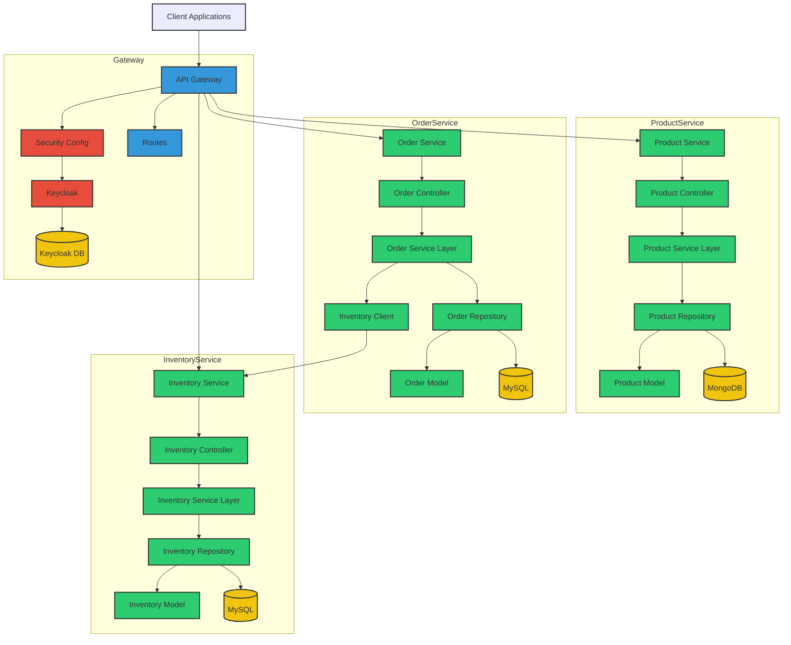

# Spring-Boot-Microservices-Angular-Product-Project

```mermaid
flowchart TB
    %% Styles
    classDef client fill:#gray,stroke:#333,stroke-width:2px
    classDef gateway fill:#3498db,stroke:#333,stroke-width:2px
    classDef service fill:#2ecc71,stroke:#333,stroke-width:2px
    classDef database fill:#f1c40f,stroke:#333,stroke-width:2px
    classDef security fill:#e74c3c,stroke:#333,stroke-width:2px

    %% Client Layer
    Client[Client Applications]:::client

    %% API Gateway Layer
    subgraph Gateway
        APIG[API Gateway]:::gateway
        SEC[Security Config]:::security
        ROUTES[Routes]:::gateway
        KEY[Keycloak]:::security
        KEYDB[(Keycloak DB)]:::database
    end

    %% Product Service
    subgraph ProductService
        PS[Product Service]:::service
        PC[Product Controller]:::service
        PSVC[Product Service Layer]:::service
        PR[Product Repository]:::service
        PM[Product Model]:::service
        MongoDB[(MongoDB)]:::database
    end

    %% Order Service
    subgraph OrderService
        OS[Order Service]:::service
        OC[Order Controller]:::service
        OSVC[Order Service Layer]:::service
        OR[Order Repository]:::service
        OM[Order Model]:::service
        IC[Inventory Client]:::service
        OrderDB[(MySQL)]:::database
    end

    %% Inventory Service
    subgraph InventoryService
        IS[Inventory Service]:::service
        IC2[Inventory Controller]:::service
        ISVC[Inventory Service Layer]:::service
        IR[Inventory Repository]:::service
        IM[Inventory Model]:::service
        InventoryDB[(MySQL)]:::database
    end

    %% Relationships
    Client --> APIG
    APIG --> SEC
    APIG --> ROUTES
    SEC --> KEY
    KEY --> KEYDB

    APIG --> PS
    APIG --> OS
    APIG --> IS

    PS --> PC
    PC --> PSVC
    PSVC --> PR
    PR --> PM
    PR --> MongoDB

    OS --> OC
    OC --> OSVC
    OSVC --> OR
    OR --> OM
    OR --> OrderDB
    OSVC --> IC
    IC --> IS

    IS --> IC2
    IC2 --> ISVC
    ISVC --> IR
    IR --> IM
    IR --> InventoryDB

    %% Click Events
    click APIG "https://github.com/selin-topcu/Spring-Boot-Microservices-Angular-Product-Project/blob/main/api-gateway/src/main/java/com/selintopcu/api_gateway/ApiGatewayApplication.java"
    click SEC "https://github.com/selin-topcu/Spring-Boot-Microservices-Angular-Product-Project/blob/main/api-gateway/src/main/java/com/selintopcu/api_gateway/config/SecurityConfig.java"
    click ROUTES "https://github.com/selin-topcu/Spring-Boot-Microservices-Angular-Product-Project/blob/main/api-gateway/src/main/java/com/selintopcu/api_gateway/routes/Routes.java"
    click KEYDB "https://github.com/selin-topcu/Spring-Boot-Microservices-Angular-Product-Project/tree/main/api-gateway/volume-data/mysql_keycloak_data"
    
    click PS "https://github.com/selin-topcu/Spring-Boot-Microservices-Angular-Product-Project/blob/main/product-service/src/main/java/com/selintopcu/microservices/product/ProductServiceApplication.java"
    click PC "https://github.com/selin-topcu/Spring-Boot-Microservices-Angular-Product-Project/blob/main/product-service/src/main/java/com/selintopcu/microservices/product/controller/ProductController.java"
    click PM "https://github.com/selin-topcu/Spring-Boot-Microservices-Angular-Product-Project/blob/main/product-service/src/main/java/com/selintopcu/microservices/product/model/Product.java"
    click PR "https://github.com/selin-topcu/Spring-Boot-Microservices-Angular-Product-Project/blob/main/product-service/src/main/java/com/selintopcu/microservices/product/repository/ProductRespository.java"
    click PSVC "https://github.com/selin-topcu/Spring-Boot-Microservices-Angular-Product-Project/blob/main/product-service/src/main/java/com/selintopcu/microservices/product/service/ProductService.java"
    click MongoDB "https://github.com/selin-topcu/Spring-Boot-Microservices-Angular-Product-Project/tree/main/product-service/data"
    
    click OS "https://github.com/selin-topcu/Spring-Boot-Microservices-Angular-Product-Project/blob/main/order-service/src/main/java/com/selintopcu/microservices/order/OrderServiceApplication.java"
    click OC "https://github.com/selin-topcu/Spring-Boot-Microservices-Angular-Product-Project/blob/main/order-service/src/main/java/com/selintopcu/microservices/order/controller/OrderController.java"
    click OM "https://github.com/selin-topcu/Spring-Boot-Microservices-Angular-Product-Project/blob/main/order-service/src/main/java/com/selintopcu/microservices/order/model/Order.java"
    click OR "https://github.com/selin-topcu/Spring-Boot-Microservices-Angular-Product-Project/blob/main/order-service/src/main/java/com/selintopcu/microservices/order/repository/OrderRepository.java"
    click OSVC "https://github.com/selin-topcu/Spring-Boot-Microservices-Angular-Product-Project/blob/main/order-service/src/main/java/com/selintopcu/microservices/order/service/OrderService.java"
    click IC "https://github.com/selin-topcu/Spring-Boot-Microservices-Angular-Product-Project/blob/main/order-service/src/main/java/com/selintopcu/microservices/order/client/InventoryClient.java"
    click OrderDB "https://github.com/selin-topcu/Spring-Boot-Microservices-Angular-Product-Project/tree/main/order-service/docker/mysql/data"
    
    click IS "https://github.com/selin-topcu/Spring-Boot-Microservices-Angular-Product-Project/blob/main/inventory-service/src/main/java/com/selintopcu/microservices/inventory_service/InventoryServiceApplication.java"
    click IC2 "https://github.com/selin-topcu/Spring-Boot-Microservices-Angular-Product-Project/blob/main/inventory-service/src/main/java/com/selintopcu/microservices/inventory_service/controller/InventoryController.java"
    click IM "https://github.com/selin-topcu/Spring-Boot-Microservices-Angular-Product-Project/blob/main/inventory-service/src/main/java/com/selintopcu/microservices/inventory_service/model/Inventory.java"
    click IR "https://github.com/selin-topcu/Spring-Boot-Microservices-Angular-Product-Project/blob/main/inventory-service/src/main/java/com/selintopcu/microservices/inventory_service/repository/InventoryRepository.java"
    click ISVC "https://github.com/selin-topcu/Spring-Boot-Microservices-Angular-Product-Project/blob/main/inventory-service/src/main/java/com/selintopcu/microservices/inventory_service/service/InventoryService.java"
    click InventoryDB "https://github.com/selin-topcu/Spring-Boot-Microservices-Angular-Product-Project/tree/main/inventory-service/docker/mysql/data"
```
